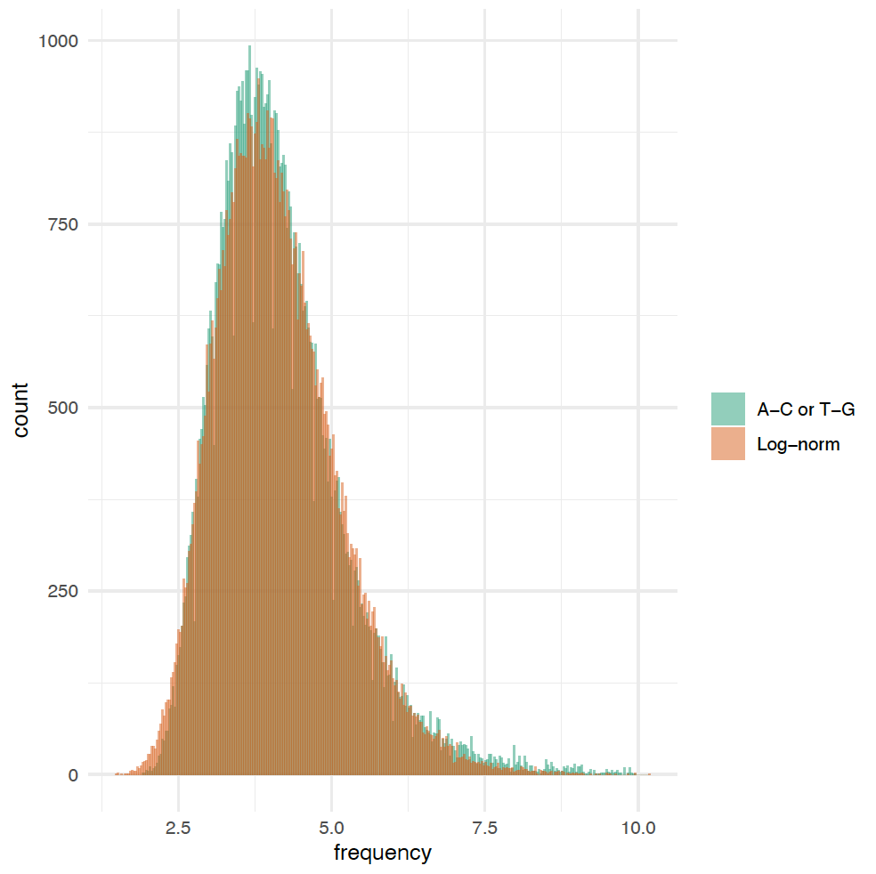
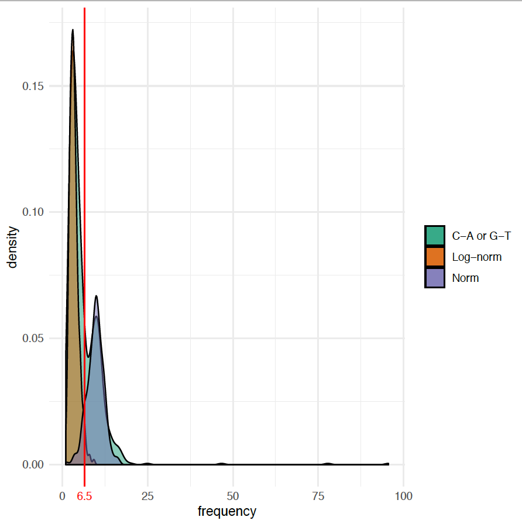

# Triclosan Experimental evolution paper
Experimental evolution of *Escherichia coli* BW25113 uxaC-Knockout with exposure to triclosan

The repository contains code that was used in the data analysis for experimental evolution of *Escherichia coli BW25113 &Delta;uxaC::kan* strain under the triclosan treatment.

FastQ files for could be downloaded from the NCBI SRA database through BioProject **PRJNA472810***.

### List of used software:
- **Trimmomatic** ([site](http://www.usadellab.org/cms/?page=trimmomatic))
- **BWA** ([site](http://bio-bwa.sourceforge.net/))
- **Picard Tools** ([site](https://broadinstitute.github.io/picard/))
- **GATK 3** ([site](https://software.broadinstitute.org/gatk/))
- **Samtools and HTSlib** ([site](http://www.htslib.org/))
- **lofreq** ([site](https://csb5.github.io/lofreq/))
- **VCFtools** ([site](http://vcftools.sourceforge.net/))
- **SnpEff** ([site](http://snpeff.sourceforge.net/))
- **Pandas** package for Python3 ([site](https://pandas.pydata.org/))
- **iJump** ([site](https://github.com/sleyn/ijump), requires **BioPython**, **pandas**, **pysam** and **pysamstats** Python3 packages)

### The variant calling steps:
1. Install all software from the list.
2. Create Ecoli\_BW25113 database for SnpEff using included `Escherichia_coli_BW25113.gbff` GenBank file (should be renamed to `genes.gbk`).
3. Run `prepare_reference.sh` to create all index files for the reference.
4. Copy fastq.gz files from the SRA.
5. Create working directory.
6. Copy `run_alignment_lofreq.sh` to the working directory.
7. Fill all required paths in `run_alignment_lofreq.sh`.
8. Run the `run_alignment_lofreq.sh`.

### Filtering sequencing data
After sequencing population samples, we found that about 95% of called variants are A-C or T-G variants. Additionally, we observed that the number of C-A and G-T variants are increased over others. Detailed analysis of reads showed the presence of increased amount of A-C and C-A substitutions. We highly doubt that these variants could reflect real mutations and consider most of them as false-positives.
To clean data we made the following filtering:
1.	**A-C/T-G variants:**
-	Frequency distribution is close to log-normal with mean=1.39, SD=0.237 (Fig. SM1);

 
**Figure SM1.** Distribution of frequencies for A-C and T-G variants combined from all samples. The histogram of frequencies drawn randomly from theoretical log-normal distribution with mean=1.39 and SD=0.237 is plotted orange.

-	Assuming log-normal distribution as the background assign probability to observe this or higher frequency as a p-value to each variant observation;
-	Compute FDR by Benjamini and Hochberg post-hoc procedure with the threshold 0.01
2.	**C-A/G-T variants:**
-	Frequency distribution is bimodal (Fig. SM2). The left part follows log-normal distribution with mean = 1.26 and SD = 0.36 and right is close to normal with mean=9.8 and SD=2.5;

 
**Figure SM2.** Distribution of frequencies for C-A and G-T variants combined from all samples. The densities of log-normal distribution with mean = 1.26 and SD = 0.36, and normal distribution with mean = 9.8 and SD=2.5 are plotted orange and purple. Red vertical line represents proposed threshold for false positives.

-	Set threshold for false-positives as intersection of both distributions at 6.5%
3.	**For all variants:**
-	Keep variants with maximum observed frequency >2%;
-	Filter out variants in predicted repeat regions;
-	Compute chi-squared test for uniformity of frequency distribution for each reactor for each variant. Keep variant if in at least one reactor p-value < 0.05;
-	Remove all variants in *uxaC* gene as *ΔuxaC* is the parent strain.
-	For some variants frequency distribution behaved as variants in repeat region although their position was not predicted as repeat region (random occurrence of nearly the same frequency in different samples). These variants were inspected and filtered manually.
